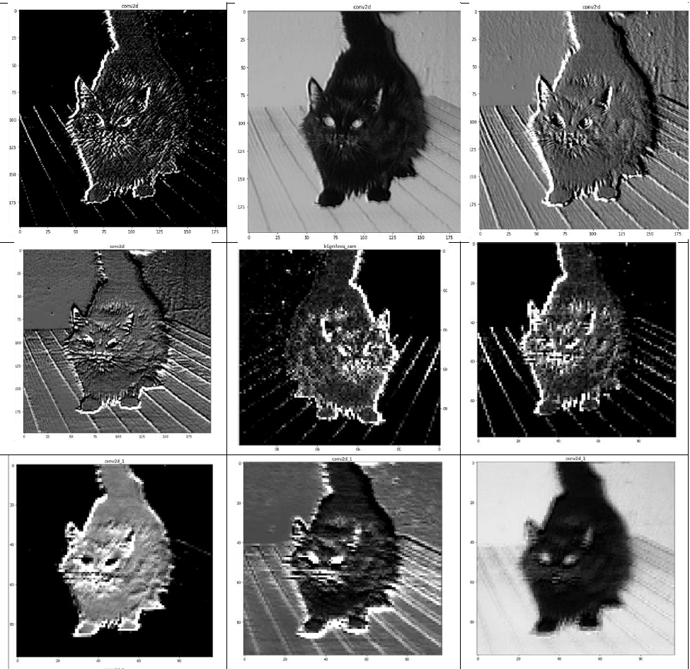
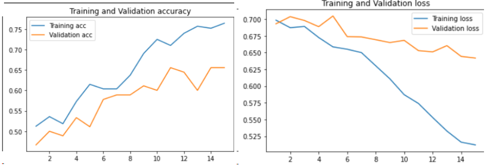
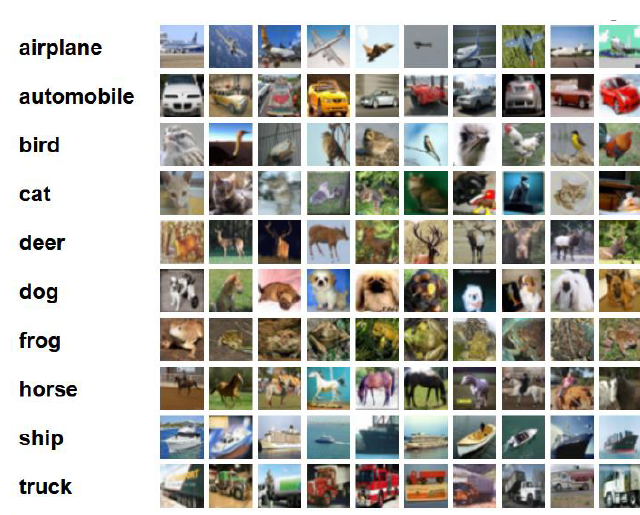
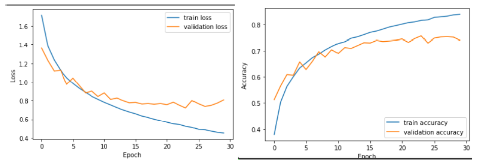
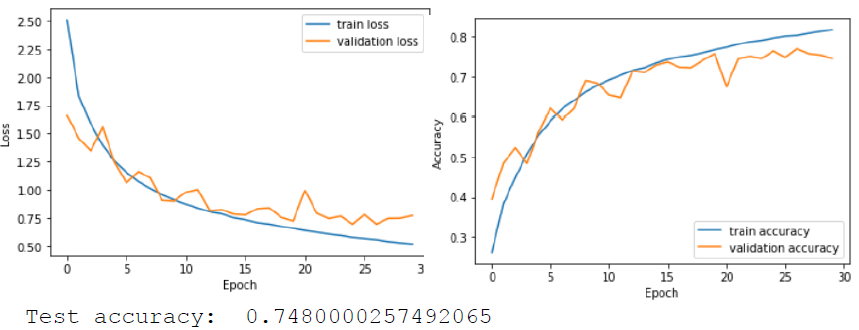

# 🧠 CNN Image Classification Experiments

This repository contains a set of **deep learning experiments for image classification**, focusing on:

- **Binary classification** – Cats vs Dogs (Kaggle dataset)
- **Multiclass classification** – CIFAR-10 (10 classes)

The project explores:

- Custom **Convolutional Neural Networks (CNNs)**
- **Transfer learning** with VGG16 (frozen vs unfrozen)
- **Data augmentation**
- Architectures with **Inception-style blocks**
- Architectures with **Residual blocks** (ResNet-style)

The goal is to compare how different architectures and training strategies impact accuracy and generalization on real-world image datasets. :contentReference[oaicite:0]{index=0}

---

📚 Datasets
🐱🐶 Cats vs Dogs (Binary classification)

Source: Kaggle “Cats and Dogs” dataset
Task: classify each image as cat or dog
Preprocessing:
filtering to .png images
resizing to a fixed size (e.g. 200×200)
train/validation/test split with train_test_split
Labels: 0 = dog, 1 = cat 

🎨 CIFAR-10 (Multiclass classification)
10 classes: airplane, automobile, bird, cat, deer, dog, frog, horse, ship, truck
50,000 training images, 10,000 test images
32×32 RGB images

🧠 Models & Experiments
1️⃣ Custom CNN – Cats vs Dogs
Several convolution + max-pooling blocks
Flatten + dense layers for classification
Trained from scratch on a subset of images (e.g. 2000 samples)
Results tracked with training/validation accuracy and loss curves 

2️⃣ Transfer Learning with VGG16
Experiments using VGG16 as a convolutional base:
Frozen base: only train custom classifier on top
Unfrozen base: fine-tune some or all convolutional layers
With and without data augmentation
Also tested larger input size (e.g. 500×500) on a reduced subset of data due to RAM limits 

3️⃣ CIFAR-10 – Baseline CNN
Initial CNN architecture:
Multiple Conv2D + BatchNorm + Dropout blocks
Flatten + Dense(10) softmax output
Reported performance (baseline model):
Test accuracy ≈ 0.736 

4️⃣ CIFAR-10 – Inception-style Blocks
Add Inception-style modules to the CNN
Use 1×1 convolutions for dimensionality reduction and parallel convolution paths
Aggregate outputs via concatenation
Result:
Test accuracy remains around 0.736 but with better representational capacity 

5️⃣ CIFAR-10 – Residual Blocks
Replace inception modules with residual connections (skip connections)
Easier gradient flow and deeper effective network
Result:
Test accuracy improves to about 0.748
Confirms the benefit of residual learning on this dataset

### 📊 Example Visualizations

#### Image Preprocessing

#### Training and Validation Loss

#### CIFAR Dataset

#### Adding Inception Blocks

#### Adding Residual Blocks

